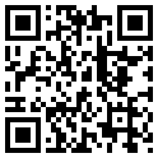
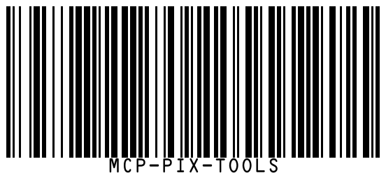

# generate_barcode

Generates barcode images in various formats. Supports 15 barcode types.

## Parameters

| Parameter | Type | Required | Default | Description |
|-----------|------|----------|---------|-------------|
| `type` | string (enum) | Yes | — | Barcode type |
| `text` | string | Yes | — | Text or data to encode |
| `format` | `"png"` \| `"svg"` | No | `"png"` | Output format |
| `scale` | number (1-10) | No | `3` | Scale multiplier |
| `includeText` | boolean | No | `true` | Whether to display text below the barcode |
| `color` | string | No | — | Barcode color (6-digit hex, e.g. `000000`) |
| `bgColor` | string | No | — | Background color (6-digit hex, e.g. `ffffff`) |
| `width` | number | No | — | Width (mm) |
| `height` | number | No | — | Height (mm) |
| `padding` | number (0-20) | No | — | Quiet-zone padding around the barcode (in module-width units). Adds a white background automatically unless `bgColor` is specified. |

## Supported Barcode Types

| type value | Description |
|------------|-------------|
| `qrcode` | QR Code (2D) |
| `code128` | Code 128 (general-purpose 1D) |
| `ean13` | EAN-13 (international product barcode) |
| `ean8` | EAN-8 (short product barcode) |
| `upca` | UPC-A (North American product barcode) |
| `upce` | UPC-E (compressed UPC) |
| `code39` | Code 39 (industrial use) |
| `code93` | Code 93 |
| `codabar` | Codabar (libraries, blood banks) |
| `interleaved2of5` | Interleaved 2 of 5 |
| `datamatrix` | Data Matrix (2D) |
| `pdf417` | PDF417 (2D) |
| `azteccode` | Aztec Code (2D) |
| `maxicode` | MaxiCode (logistics) |
| `gs1-128` | GS1-128 (logistics/supply chain) |

## Examples

### QR Code

```json
{
  "type": "qrcode",
  "text": "https://github.com/supra126/mcp-pix-tools",
  "format": "png",
  "scale": 5
}
```

### Colored Code128

```json
{
  "type": "code128",
  "text": "HELLO-2026",
  "color": "003366",
  "bgColor": "f5f5f5",
  "scale": 4
}
```

### EAN-13 Product Barcode

```json
{
  "type": "ean13",
  "text": "4710088430404",
  "format": "svg"
}
```

### QR Code with Padding

```json
{
  "type": "qrcode",
  "text": "https://example.com",
  "padding": 4,
  "scale": 5
}
```

### Data Matrix (Without Text)

```json
{
  "type": "datamatrix",
  "text": "Serial-ABC-12345",
  "includeText": false,
  "scale": 6
}
```

## Output Examples

<table>
<tr>
<td align="center"><strong>QR Code</strong></td>
<td align="center"><strong>Code 128</strong></td>
</tr>
<tr>
<td></td>
<td></td>
</tr>
</table>

## Response Format

- **PNG**: `{ type: "image", data: "<base64>", mimeType: "image/png" }`
- **SVG**: `{ type: "text", text: "<svg>...</svg>" }`

## Notes

- Different barcode types have different format requirements for `text` (e.g., EAN-13 requires 13 digits)
- If the text format does not match the barcode specification, bwip-js will return an error message
- `width` and `height` are in millimeters (mm), not pixels
