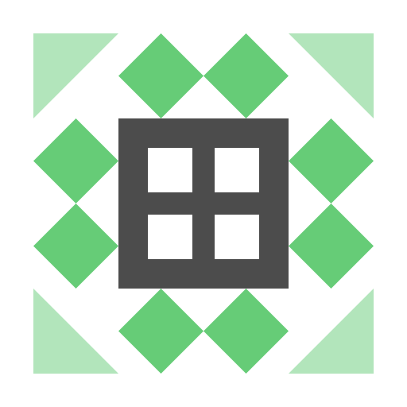

# generate_identicon

根據輸入字串生成唯一的幾何圖案頭像（Identicon）。

## 參數

| 參數 | 類型 | 必填 | 預設值 | 說明 |
|------|------|------|--------|------|
| `value` | string | 是 | — | 輸入字串（會被 hash 為圖案） |
| `size` | number (16-1024) | 否 | `256` | 圖片大小（px，正方形） |
| `format` | `"png"` \| `"svg"` | 否 | `"png"` | 輸出格式 |
| `background` | string | 否 | — | 背景色（hex，如 `ffffff` 或 `ffffff00` 含透明度） |
| `saturation` | number (0-1) | 否 | — | 色彩飽和度 |

## 特性

- **確定性**：相同輸入永遠產生相同圖案
- **唯一性**：不同輸入產生不同圖案
- **對稱性**：生成的圖案為對稱幾何圖形

## 範例

### 基本頭像

```json
{
  "value": "user@example.com",
  "size": 256,
  "format": "png"
}
```

### 透明背景

```json
{
  "value": "john_doe",
  "size": 128,
  "background": "ffffff00"
}
```

### 低飽和度

```json
{
  "value": "project-alpha",
  "saturation": 0.3,
  "format": "svg"
}
```

### 白色背景大頭像

```json
{
  "value": "company-id-12345",
  "size": 512,
  "background": "ffffff"
}
```

## 輸出範例

<table>
<tr>
<td align="center"><code>"supra126"</code></td>
<td align="center"><code>"user@example.com"</code></td>
</tr>
<tr>
<td></td>
<td></td>
</tr>
</table>

*相同輸入永遠產生相同的唯一圖案*

## 使用場景

- 使用者預設頭像（根據 email 或 username 生成）
- 專案/組織識別圖示
- 資料視覺化中的節點圖示
- GitHub 風格的匿名頭像
