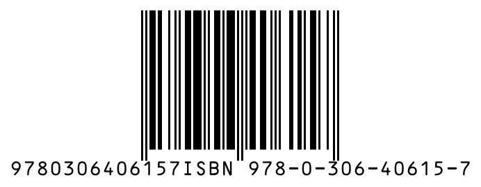

# generate_isbn

Generates ISBN barcodes with check digit validation and ISBN-10/13 format conversion.

## Parameters

| Parameter | Type | Required | Default | Description |
|-----------|------|----------|---------|-------------|
| `isbn` | string | Yes | — | ISBN-10 or ISBN-13 (hyphens allowed) |
| `format` | `"png"` \| `"svg"` | No | `"png"` | Output format |
| `scale` | number (1-10) | No | `3` | Scale multiplier |
| `includeText` | boolean | No | `true` | Whether to display ISBN text |
| `bgColor` | string | No | — | Background color (6-digit hex, e.g. `ffffff`) |
| `padding` | number (0-20) | No | — | Quiet-zone padding around the barcode (in module-width units). Adds a white background automatically unless `bgColor` is specified. |

## Features

### Automatic Validation

The tool automatically validates the ISBN check digit:
- ISBN-10: Weighted sum modulo 11
- ISBN-13: Alternating weighted sum modulo 10

If the check digit is incorrect, a warning is included in the response, but the barcode is still generated.

### Format Conversion

- Input ISBN-10 → Also displays the corresponding ISBN-13
- Input ISBN-13 (starting with 978) → Also displays the corresponding ISBN-10
- Input ISBN-13 (starting with 979) → Cannot convert to ISBN-10 (shows N/A)

### Hyphen Handling

Hyphens and spaces in the input ISBN are automatically stripped:
- `978-0-306-40615-7` → `9780306406157`
- `0-306-40615-2` → `0306406152`

## Examples

### ISBN-13

```json
{
  "isbn": "9780306406157",
  "format": "png"
}
```

### ISBN-10

```json
{
  "isbn": "0306406152",
  "format": "svg"
}
```

### ISBN with Hyphens

```json
{
  "isbn": "978-986-123-456-7"
}
```

### ISBN-10 with X Check Digit

```json
{
  "isbn": "155404295X"
}
```

## Output Example



*ISBN-13 barcode with padding and white background*

## Response Format

The response contains two content items:

1. **Text metadata**:
```
ISBN Input: 9780306406157
Valid: Yes
ISBN-13: 9780306406157
ISBN-10: 0306406152
```

2. **Barcode image** (PNG or SVG)

## Error Cases

- ISBN length is not 10 or 13 → Returns `isError: true` with an explanation
- Incorrect check digit → Barcode is still generated, but the metadata includes a warning
