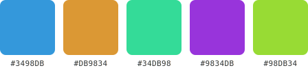
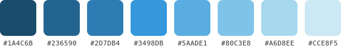

# generate_palette

根據色彩理論從基礎色生成調色盤/色票卡。

## 參數

| 參數 | 類型 | 必填 | 預設值 | 說明 |
|------|------|------|--------|------|
| `baseColor` | string | 是 | — | 基礎色（hex，如 `#3498db` 或 `3498db`） |
| `scheme` | string (enum) | 否 | `"analogous"` | 配色方案 |
| `count` | number (2-12) | 否 | `5` | 生成顏色數量 |
| `format` | `"png"` \| `"svg"` | 否 | `"png"` | 輸出格式 |
| `swatchSize` | number (40-200) | 否 | `100` | 色票方塊大小（px） |

## 配色方案

| scheme | 說明 | 色相關係 |
|--------|------|----------|
| `complementary` | 互補色 | 色環對面（+180°） |
| `analogous` | 類似色 | 色環相鄰（±30°） |
| `triadic` | 三等分 | 色環三等分（+120°） |
| `tetradic` | 四等分 | 色環四等分（+90°） |
| `monochromatic` | 單色漸變 | 同色相，不同明度 |
| `split-complementary` | 分裂互補 | 互補色兩側（+150°, +210°） |

## 範例

### 三等分配色

```json
{
  "baseColor": "#3498db",
  "scheme": "triadic",
  "count": 6,
  "format": "png"
}
```

### 單色漸變

```json
{
  "baseColor": "e74c3c",
  "scheme": "monochromatic",
  "count": 8,
  "swatchSize": 80
}
```

### 互補色 SVG

```json
{
  "baseColor": "#2ecc71",
  "scheme": "complementary",
  "format": "svg"
}
```

## 輸出範例

**三等分配色**



**單色漸變（8 色）**



## 回傳格式

回傳包含兩個 content 項目：

1. **文字**：配色方案名稱 + 所有色碼列表
```
Palette: triadic from #3498DB
1. #3498DB
2. #DB3434
3. #34DB34
```

2. **色票圖片**（PNG 或 SVG）：每個顏色顯示為圓角方塊，下方標示 hex 色碼
