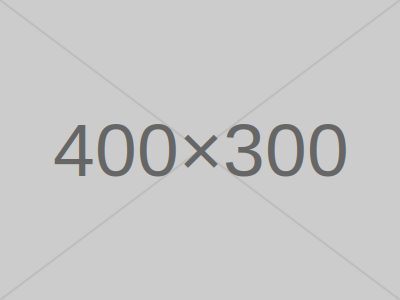

# generate_placeholder

Generates placeholder images for wireframes and mockup designs.

## Parameters

| Parameter | Type | Required | Default | Description |
|-----------|------|----------|---------|-------------|
| `width` | number (1-4096) | Yes | — | Image width (px) |
| `height` | number (1-4096) | Yes | — | Image height (px) |
| `bgColor` | string | No | `"cccccc"` | Background color (6-digit hex) |
| `textColor` | string | No | `"666666"` | Text color (6-digit hex) |
| `text` | string | No | `"WIDTHxHEIGHT"` | Custom text |
| `format` | `"png"` \| `"svg"` | No | `"png"` | Output format |

## Examples

### Default Placeholder

```json
{
  "width": 800,
  "height": 600
}
```

Generates an 800x600 gray background with "800x600" text in the center.

### Custom Text and Colors

```json
{
  "width": 1200,
  "height": 400,
  "bgColor": "1a1a2e",
  "textColor": "e0e0e0",
  "text": "Hero Banner"
}
```

### Small Icon Placeholder

```json
{
  "width": 64,
  "height": 64,
  "bgColor": "3498db",
  "textColor": "ffffff",
  "text": "Icon"
}
```

### SVG Format

```json
{
  "width": 400,
  "height": 300,
  "format": "svg"
}
```

## Output Examples

<table>
<tr>
<td align="center"><strong>Default</strong></td>
<td align="center"><strong>Custom Colors</strong></td>
</tr>
<tr>
<td></td>
<td></td>
</tr>
</table>

## Image Characteristics

- Solid color background
- Diagonal cross lines (semi-transparent, visually marking the image as a placeholder)
- Centered text (font size automatically adjusts based on image dimensions)
