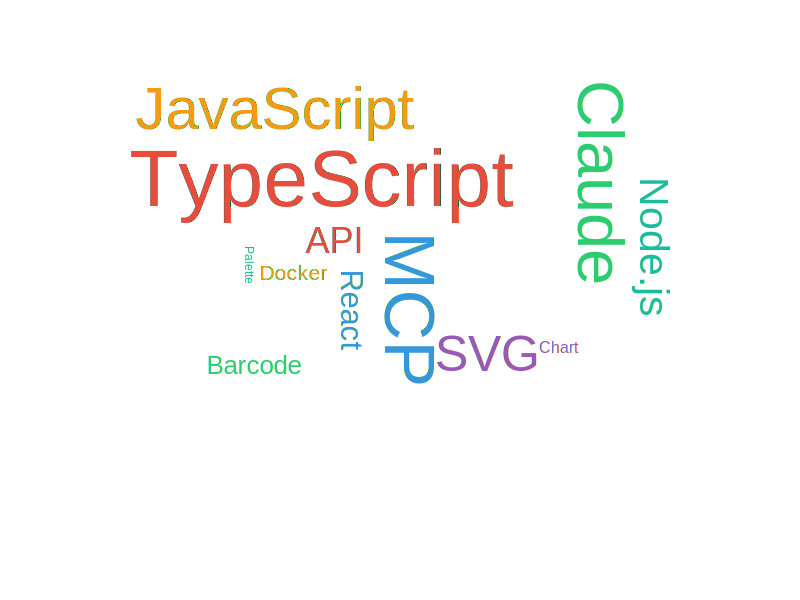

# generate_wordcloud

Generates a word cloud image from a weighted array of words.

## Parameters

| Parameter | Type | Required | Default | Description |
|-----------|------|----------|---------|-------------|
| `words` | array | Yes | — | Word array (1-500 items) |
| `words[].text` | string | Yes | — | Word text |
| `words[].weight` | number (>=1) | Yes | — | Weight/frequency |
| `width` | number (100-2000) | No | `800` | Canvas width (px) |
| `height` | number (100-2000) | No | `600` | Canvas height (px) |
| `format` | `"png"` \| `"svg"` | No | `"png"` | Output format |
| `colorScheme` | string (enum) | No | `"vibrant"` | Color scheme |
| `fontFamily` | string | No | `"Arial"` | Font family name |
| `maxFontSize` | number (10-200) | No | `80` | Maximum font size |
| `minFontSize` | number (8-50) | No | `12` | Minimum font size |

## Color Schemes

| colorScheme | Color Style |
|-------------|-------------|
| `vibrant` | Vivid and colorful (red, blue, green, orange, purple, teal) |
| `ocean` | Ocean blue tones |
| `sunset` | Warm sunset tones |
| `forest` | Forest green tones |
| `mono` | Grayscale monochrome |

## Examples

### Basic Word Cloud

```json
{
  "words": [
    { "text": "TypeScript", "weight": 100 },
    { "text": "JavaScript", "weight": 80 },
    { "text": "Node.js", "weight": 60 },
    { "text": "MCP", "weight": 90 },
    { "text": "React", "weight": 50 },
    { "text": "Docker", "weight": 40 }
  ]
}
```

### Custom Color Scheme and Size

```json
{
  "words": [
    { "text": "Artificial Intelligence", "weight": 100 },
    { "text": "Machine Learning", "weight": 85 },
    { "text": "Deep Learning", "weight": 70 },
    { "text": "Natural Language Processing", "weight": 60 }
  ],
  "colorScheme": "ocean",
  "width": 1200,
  "height": 800,
  "maxFontSize": 120,
  "format": "svg"
}
```

## Output Example



*Word cloud with vibrant color scheme*

## Layout Algorithm

Uses d3-cloud for word layout:
- Higher-weight words get larger font sizes
- Words are automatically rotated (0 or 90 degrees) to fill the space
- A 5px padding is maintained between words

## Font Notes

- `fontFamily` is written into the SVG's `font-family` attribute
- **SVG output**: Fonts are rendered by the display environment; any available font can be used
- **PNG output**: Depends on system fonts in the execution environment
- The Docker image includes Noto Sans CJK (Chinese, Japanese, Korean fonts)
